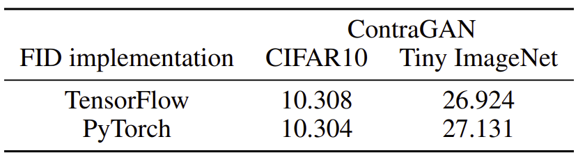

## StudioGAN: A Library for Experiment and Evaluation of GANs (Early Version)

StudioGAN is a Pytorch library providing the implementation of representative Generative Adversarial Networks (GANs) for conditional/unconditional image synthesis. This project aims to help machine learning researchers to compare the new idea with other GANs in the same Pytorch environment.


## 1. Implemented GANs

* [Vanilla DCGAN (Radford et al.)](https://arxiv.org/abs/1511.06434)
* [WGAN Weight Clipping (Arjovsky et al.)](https://arxiv.org/abs/1701.07875)
* [WGAN Gradient Penalty (Gulrajani et al.)](https://arxiv.org/abs/1704.00028)
* [ACGAN (Odena et al.)](https://arxiv.org/abs/1610.09585)
* [Geometric GAN (Lim and Ye)](https://arxiv.org/abs/1705.02894)
* [cGAN (Miyato and Koyama)](https://arxiv.org/abs/1705.02894)
* [SNDCGAN,SNResGAN (Miyato et al.)](https://arxiv.org/abs/1802.05957)
* [SAGAN (Zhang et al.)](https://arxiv.org/abs/1805.08318)
* [BigGAN (Brock et al.)](https://arxiv.org/abs/1809.11096)
* [BigGAN-Deep (Brock et al.)](https://arxiv.org/abs/1809.11096)
* [CRGAN (Zhang et al.)](https://arxiv.org/abs/1910.12027)
* [ICRGAN (Zhao et al.)](https://arxiv.org/abs/2002.04724)
* [DiffAugment (Zhao et al.)](https://arxiv.org/abs/2006.10738)
* [Adaptive Discriminator Augmentation (Karras et al.)](https://arxiv.org/abs/2006.06676)
* [ContraGAN (Ours)](https://github.com/)

## 2. To be implemented
* [LOGAN (Wu et al.)](https://arxiv.org/abs/1912.00953)

## 3. Requirements

- Anaconda
- Python > 3.6
- torch > 1.6.0
- torchvision > 0.7.0
- Pillow < 7
- apex 0.1 (for fused optimiers)
- tensorboard
- h5py
- tqdm

You can install the recommended environment setting as follows:

```
conda env create -f environment.yml -n StudioGAN
```

or using docker
```
docker pull minguk/studio_gan:latest
```

## 4. Dataset(CIFAR10, Tiny ImageNet, ImageNet possible)
The folder structure of the datasets is shown below:
```
├── data
   └── ILSVRC2012
       ├── train
           ├── n01443537
     	        ├── image1.png
     	        ├── image2.png
		└── ...
           ├── n01629819
           └── ...
       ├── valid
           └── val_folder
	        ├── val1.png
     	        ├── val2.png
		└── ...
```


## 5. How to run

For CIFAR10 image generation:

```
CUDA_VISIBLE_DEVICES=0 python3 main.py -t -e -rm_API -c "./configs/Table1/contra_biggan_cifar32_hinge_no.json"
```

For Tiny ImageNet image generation:

```
CUDA_VISIBLE_DEVICES=0,1,2,3 python3 main.py -t -e -rm_API -c "./configs/Table1/contra_biggan_tiny32_hinge_no.json"
```

For ImageNet image generation:

```
CUDA_VISIBLE_DEVICES=0,1,2,3,4,5,6,7 python3 main.py -t -e -rm_API -c "./configs/Imagenet_experiments/contra_biggan_imagenet128_hinge_no.json"
```

For ImageNet image generation (loading all images into main memory to reduce I/O bottleneck):
```
CUDA_VISIBLE_DEVICES=0,1,2,3,4,5,6,7 python3 main.py -t -e -rm_API -c "./configs/Imagenet_experiments/contra_biggan_imagenet128_hinge_no.json" -l
```

## 6. About PyTorch FID

FID is a widely used metric to evaluate the performance of a GAN model. Calculating FID requires a pre-trained inception-V3 network, and approaches use Tensorflow-based FID (https://github.com/bioinf-jku/TTUR), or PyTorch-based FID (https://github.com/mseitzer/pytorch-fid). StudioGAN utilizes the PyTorch-based FID to test GAN models in the same PyTorch environment seamlessly. We show that the PyTorch based FID implementation used in StudioGAN provides almost the same results with the TensorFlow implementation. The results are summarized in the table below.
<p align="center">

## 6. References

**Self-Attention module:** https://github.com/voletiv/self-attention-GAN-pytorch

**DiffAugment:** https://github.com/mit-han-lab/data-efficient-gans

**Adaptive Discriminator Augmentation:** https://github.com/rosinality/stylegan2-pytorch

**Exponential Moving Average:** https://github.com/ajbrock/BigGAN-PyTorch

**Tensorflow FID:** https://github.com/bioinf-jku/TTUR

**Pytorch FID:** https://github.com/mseitzer/pytorch-fid

**Synchronized BatchNorm:** https://github.com/vacancy/Synchronized-BatchNorm-PyTorch

**Implementation Details:** https://github.com/ajbrock/BigGAN-PyTorch

## Citation
StudioGAN is established for the following research project. Please cite our work if you use StudioGAN.
```bib
@article{kang2020ContraGAN,
  title   = {{Contrastive Generative Adversarial Networks}},
  author  = {Minguk Kang and Jaesik Park},
  journal = {arXiv preprint arXiv:2006.12681},
  year    = {2020}
}
```
