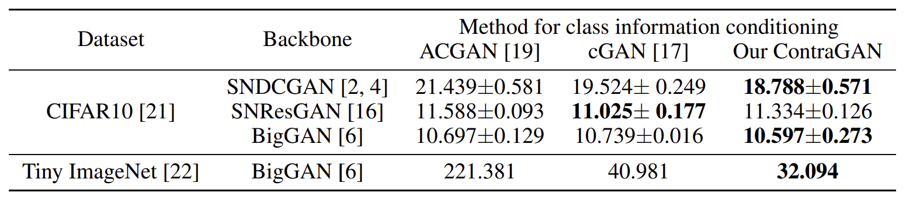

## Contrastive Generative Adversarial Networks

**Abstract**

Conditional image synthesis is the task to generate high-fidelity diverse images using class label information. Although many studies have shown realistic results, there is room for improvement if the number of classes increases. In this paper, we propose a novel conditional contrastive loss to maximize a lower bound on mutual information between samples from the same class. Our framework, called Contrastive Generative Adversarial Networks (ContraGAN), learns to synthesize images using class information and data-to-data relations of training examples. The discriminator in ContraGAN discriminates the authenticity of given samples and maximizes the mutual information between embeddings of real images from the same class. Simultaneously, the generator attempts to synthesize images to fool the discriminator and to maximize the mutual information of fake images from the same class prior. The experimental results show that ContraGAN is robust to network architecture selection and outperforms state-of-the-art models by 3.7% and 11.2% on CIFAR10 and Tiny ImageNet datasets, respectively, without any data augmentation. For the fair comparison, we re-implement nine state-of-the-art approaches to test various methods under the same condition. 


## 1. Illustrative Figures of Conditional Contrastive Loss
<p align="center">


Illustrative figures visualize the metric learning losses (a,b,c) and conditional GANs (d,e,f). The objective of all losses is to collect samples if they have the same label but keep them away otherwise. The color indicates the class label, and the shape represents the role. (Square) an embedding of an image. (Diamond) an augmented embedding. (Circle) a reference. Each loss is applied to the reference. (Star) the embedding of a class label. (Triangle) the one-hot encoding of a class label. The thicknesses of red and blue lines represents the strength of pull and push force, respectively. Compared to ACGAN and cGAN, our loss is inspired by XT-Xent to consider data-to-data relationships and to infer full information without data augmentation.


## 2. Schematics of the discriminator of three conditional GANs


Schematics of the discriminators of three conditional GANs. (a) ACGAN has an auxiliary classifier to help the generator to synthesize well-classifiable images. (b) cGAN improves the ACGAN by adding the inner product of an embedded image and the corresponding class embedding. (c) Our approach extends cGAN with conditional contrastive loss (2C loss) between embedded images and the actual label embedding. ContraGAN considers multiple positive and negative pairs in the same batch, as shown in the above figure (f).

## 3. Results

### Quantitative Results
**Table1:** Experiments using CIFAR10 and Tiny ImageNet dataset. Using three backbone architectures (SNDCGAN, SNResGAN, and BigGAN), we test three approaches using different class information conditioning (ACGAN, cGAN, and ours). Mean +- variance of FID is reported.
<p align="center">

**Table2:** Comparison with state-of-the-art GAN models. We mark "*" to FID values reported in the original papers (BigGAN and CRGAN). The other FID values are obtained from our implementation.
<p align="center">

### Qualitative Results
**Figure 1:** Examples of generated images using ContraGAN. (left) CIFAR10, FID: 10.322, (right) Tiny ImageNet, FID: 27.018. 
<p align="center">

## 4. Pre-trained model on Tiny ImageNet
```
https://drive.google.com/file/d/1XsouS_HIlES9CAshrtgYA3b6H2qUXTnx/view?usp=sharing
```

## 5. How to run

For CIFAR10 image generation tasks:

```
CUDA_VISIBLE_DEVICES=0 python3 main.py --eval -t -c "./configs/Table1/contra_biggan32_cifar_hinge_no.json"
```

For Tiny ImageNet generation tasks:

```
CUDA_VISIBLE_DEVICES=0,1,2,3 python3 main.py --eval -t -c "./configs/Table1/contra_biggan64_tiny_hinge_no.json"
```

To use pre-trained model on Tiny ImageNet:
```
CUDA_VISIBLE_DEVICES=0,1,2,3 python3 main.py -c "./configs/Table1/contra_biggan64_tiny_hinge_no.json" --checkpoint_folder "./checkpoints/contra_tiny_imagenet_pretrained" --step 50000 --eval -t
```
